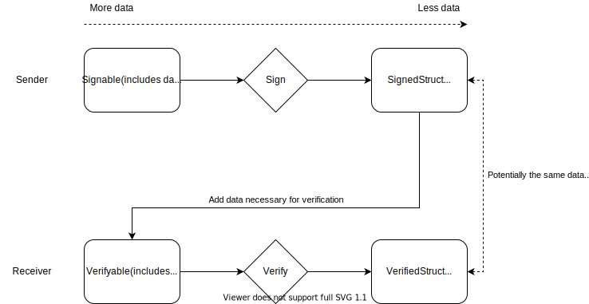

# Type-Enforced Verification

We use Rust's type checker to achieve additional security guarantees regarding
the signing and verification of structs. There are four traits:

* `Signable`: A payload that the sender/signer of a message can create. The
  trait provides a `sign` function that produces a `SignedStruct`.
* `SignedStruct`: The result of signing a `Signable` struct. This struct can
  actually be encoded and sent over the wire. The `SignedStruct` does not
  necessarily contain all the information required to sign or verify the struct.
* `Verifiable`: A payload, potentially received from the wire with a signature
  and all information required to verify the struct. When receiving a
  `SignedStruct`, the receiver can add additional information required to make
  the struct verifiable. Provides a `verify` function.
* `VerifiedStruct`: The result of calling the `verify` function on a
  `Verifiable` struct. The `VerifiedStruct` is what is accepted by further
  processing functions on the receiving side.

